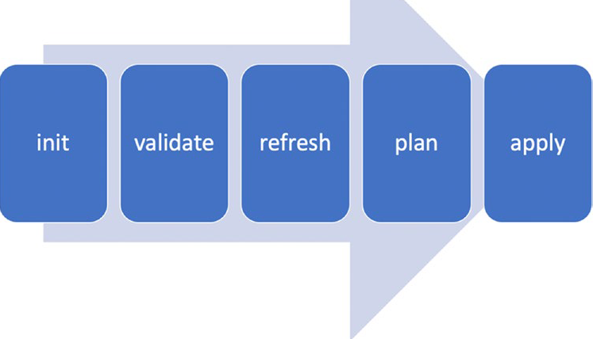

Terraform on Azure

**Infrastructure as Code**

Infrastructure as Code (IaC) is a method of managing and provisioning IT
infrastructure through machine-readable definition files, rather than
using physical hardware configuration or manual interactive
configuration tools. Essentially, IaC treats infrastructure setup and
configuration in the same way software code is treated, allowing for
automation, versioning, reproducibility, and consistency.

**Key Points about IaC:**

-   **Declarative Approach**: With IaC, you define the desired state of
    your infrastructure, and the IaC tool ensures that the current state
    matches this desired state. This contrasts with a procedural
    approach where you\'d specify a series of steps to achieve the
    desired state.

-   **Version Control:** Just like software code, infrastructure code
    can be versioned. This means you can track changes, roll back to
    previous configurations, and maintain a history of infrastructure
    states.

-   **Automation:** IaC allows for automated setup, scaling, and
    management of infrastructure, reducing manual errors and speeding up
    deployment processes.

-   **Consistency:** By defining infrastructure as code, you ensure that
    every deployment follows the same steps and configurations, leading
    to consistent environments.

-   **Reproducibility:** If you need to recreate an environment (e.g.,
    for disaster recovery or setting up a new region), IaC allows you to
    do so reliably and efficiently.

-   **Integration with DevOps**: IaC is a cornerstone of the DevOps
    movement, enabling continuous integration and continuous deployment
    (CI/CD) pipelines to operate smoothly by ensuring infrastructure is
    always in the desired state.

-   **Tools:** Popular IaC tools include Terraform, Ansible, Chef,
    Puppet, and many cloud-specific tools like AWS CloudFormation and
    Azure Resource Manager templates.

**Terraform: A Key IaC Tool**

Terraform, developed by Hashicorp, is a premier open-source IaC tool
that supports multicloud and hybrid infrastructures. Crafted in Golang,
it uses its own declarative scripting language, Hashicorp Configuration
Language (HCL), which dictates \"what\" infrastructure components should
be provisioned.

**Key Features:**

-   **CLI Interface:** Terraform\'s primary interactions occur through
    its Command-Line Interface (CLI). This CLI can execute commands
    against target environments based on script configurations. These
    commands can be run manually or via orchestration tools like Jenkins
    or Azure DevOps.

-   **State Management:** Terraform manages resources using a state
    file, a topic elaborated on in later chapters.

-   **Logging & Auditing:** Terraform offers comprehensive logs and can
    function in multi-team settings. It has a locking feature for queued
    script execution, ensuring smooth operations in collaborative
    environments.

-   **Version Control & Testing:** Terraform scripts can be
    version-controlled and tested using Golang\'s testing facilities.

-   **Configuration:** HCL configurations comprise a static script and
    dynamic values. While the script remains consistent across
    environments, the values can vary. This separation allows for the
    deployment of multiple environments with unique configurations using
    a generic script.

-   **Idempotency:** Terraform scripts produce consistent outputs for
    given configuration values, regardless of execution frequency.

In essence, Terraform is a robust tool for IaC, with features that
streamline infrastructure provisioning and management. Detailed
exploration of its capabilities continues in subsequent chapters.

**Terraform: Architecture & Key Concepts**

Terraform is an orchestration tool designed to manage and consume remote
APIs, often provided by cloud platforms. It streamlines the use of these
upstream APIs.

Crafted in Golang, Terraform can directly interact with APIs. However, a
more efficient approach is through a client library, which simplifies
the underlying HTTP communication, offering a clear interface for the
APIs. Each cloud platform typically has its own client library.

Terraform\'s unique strength lies in its plugin system. It separates its
core functionalities from plugins, ensuring modularity. These plugins
can be:

-   **Providers:** These are specific to platforms or services, like
    cloud platforms. They define and provide the resources you want to
    manage. For instance, Azure\'s provider for Terraform is
    \"terraform-provider-azurerm\", which manages Azure-specific
    resources.

-   **Provisioners:** These are used to execute scripts on a local or
    remote machine as part of resource creation or destruction.

Terraform\'s architecture is built on extensibility, allowing seamless
integration with various platforms through its providers, while also
enabling specific configurations via provisioners. Understanding this
architecture is pivotal before diving into its practical applications.
The subsequent steps would involve Terraform\'s installation and usage.


**Setting Up the Development Environment with Terraform**

To set up Terraform:

**1. Manual Installation:**

-   Download the zip file from Terraform\'s official downloads page.

-   Unzip the file to extract the Terraform binary.

-   Add the folder containing the binary to your system\'s PATH
    environment variable. This allows you to run Terraform from the
    command line without specifying its full path.

-   One benefit of this method is that Hashicorp directly manages the
    zip file, ensuring you always have access to the latest version
    before other installation methods.

**Package Manager Installation:**

-   Terraform can also be installed using the specific package manager
    for your operating system.

Choose the method that best suits your preferences and setup needs.

**Understanding Terraform\'s Functionality**

Terraform operates through a command-line interface (CLI) that processes
commands and their respective parameters. After installing Terraform on
a workstation and adding it to the system\'s PATH, you can access its
full suite of commands. Simply typing \"terraform\" in a terminal, like
CMD for Windows or Bash for Linux/Mac, will display all available
commands. These commands facilitate various tasks, from initializing a
Terraform environment to applying script configurations to the desired
environment.

**Understanding Terraform\'s State**

You might be curious about how Terraform discerns between a fresh
environment and one it has interacted with before. How does it decide
whether to create, update, or assess the current configuration of cloud
resources? The answer lies in the \'state file\'.

The state file is a JSON-formatted, Terraform-managed document that
captures the current configuration of resources. Generated the first
time a configuration file runs, this file mirrors Terraform\'s
perspective of the actual cloud infrastructure. Rather than directly
comparing local configurations with cloud resources, Terraform contrasts
its state file with the configuration to determine actions like resource
creation, updates, or replacements due to incompatible configuration
drifts.

This state file, a local reflection of the target environment, is
frequently read and updated during various Terraform operations. Its
intricate workings will be delved into in the upcoming chapter.

To truly excel with Terraform, one must craft quality configuration
files, adeptly manage both the Terraform and target cloud environments,
and deeply understand Terraform\'s architecture.

```json
{
  "version": 4,
  "terraform_version": "1.5.4",
  "serial": 3,
  "lineage": "b145f7d3-c5c5-6dce-2f63-24bbec854725",
  "outputs": {
    "resource_group_name": {
      "value": {
        "id": "/subscriptions/subscriptionid/resourceGroups/test-rg",
        "location": "eastus",
        "name": "test-rg",
        "tags": null,
        "timeouts": null
      },
      "type": [
        "object",
        {
          "id": "string",
          "location": "string",
          "name": "string",
          "tags": [
            "map",
            "string"
          ],
          "timeouts": [
            "object",
            {
              "create": "string",
              "delete": "string",
              "read": "string",
              "update": "string"
            }
          ]
        }
      ]
    }
  },
  "resources": [
    {
      "mode": "managed",
      "type": "azurerm_resource_group",
      "name": "testrg",
      "provider": "provider[\"registry.terraform.io/hashicorp/azurerm\"]",
      "instances": [
        {
          "schema_version": 0,
          "attributes": {
            "id": "/subscriptions/bb204c14-d129-477a-a3f3-02caac271ff7/resourceGroups/test-rg",
            "location": "eastus",
            "name": "test-rg",
            "tags": null,
            "timeouts": null
          },
          "sensitive_attributes": [],
          "private": "eyJlMmJmYjczMC1lY2FhLTExZTYtOGY4OC0zNDM2M2JjN2M0YzAiOnsiY3JlYXRlIjo1NDAwMDAwMDAwMDAwLCJkZWxldGUiOjU0MDAwMDAwMDAwMDAsInJlYWQiOjMwMDAwMDAwMDAwMCwidXBkYXRlIjo1NDAwMDAwMDAwMDAwfX0="
        }
      ]
    }
  ],
  "check_results": null
}
```

**Crafting Your Initial Terraform Configuration**

Terraform utilizes the Hashicorp Configuration Language (HCL) for its
configurations. HCL is a straightforward language designed to depict
infrastructure resources as text, saved with a .tf file extension.
```HCL

terraform {

    required_version = "~>1.5.0"

    required_providers {

    azurerm = {

     version = "~> 3.7.0"

    source = "hashicorp/azurerm"

    }

   }  

}

provider "azurerm" {

  features {}

}

resource "azurerm_resource_group" "testrg" {

  name = "test-rg"

  location  =  "East Us"

}

output "resource_group_name" {

  value = azurerm_resource_group.testrg

}

```

**terraform Block:**

**required_version = \"\~\>1.5.0\"** specifies that this configuration
is compatible with Terraform versions that are at least 1.5.0 and below
2.0.0.

**required_providers Block:**

This block specifies the providers required for this configuration.

**azurerm** specifies the Azure Resource Manager (ARM) provider.

-   **version = \"\~\> 3.7.0**\" indicates that the configuration is
    compatible with the azurerm provider versions that are at least
    3.7.0 and below 4.0.0.

-   **source = \"hashicorp/azurerm\"** defines the source of the
    provider, which in this case is HashiCorp\'s official provider
    repository.

**provider** Block:

This block configures the Azure Resource Manager (ARM) provider.

-   **features {}** is a configuration block required by the Azure
    provider to indicate that you\'re using the latest version of the
    Azure features.

resource Block for Resource Group:

This block defines a resource of **type azurerm_resource_group.**

-   **name = \"test-rg\"** specifies the name of the Azure Resource
    Group.

-   **location = \"East Us\"** specifies the Azure region where the
    resource group will be created.

**Deploying a Terraform Configuration to Azure**

With our Terraform configuration set, it\'s time to run it. This process
involves several steps and requires input values for three variables
during execution. Ensure you run the commands in the directory
containing all Terraform files, as Terraform typically uses the current
directory as its working context unless specified otherwise**.**

Here\'s a step-by-step guide to deploying your Terraform configuration:

**Initialization:** Set up the Terraform environment in the directory
with your configuration script.

**Validation:** Check the configuration files for syntax and
consistency.

**State Update:** Align the state file with the actual cloud
infrastructure.

**Execution Plan:** Preview the changes that will be made in the target
environment**.**

**Deployment:** Implement the configuration in the target Azure
environment**.**



**Terraform cheat sheet**

**Initialization:**

**terraform init:** This command prepares your working directory for
other Terraform operations. It\'s the first command you should run. It
initializes various local settings and data that will be used by
subsequent commands. The init command also downloads any provider
plugins required for the project.

**Configuration Validation:**

**terraform validate:** Validates the Terraform files in the directory.
It checks for any syntax errors, missing arguments, or any other
discrepancies that could disrupt the apply process.

**Planning and Applying:**

**terraform plan:** Provides a preview of the actions that Terraform
will execute based on the current configuration compared to the state.
It\'s a way to see what changes will be made without committing those
changes.

**terraform apply:** Executes the actions proposed in the Terraform plan
to achieve the desired infrastructure state. It will prompt for
confirmation by default.

**terraform apply -auto-approve:** This bypasses the confirmation prompt
and directly applies the changes. Use with caution.

**State Management:**

**terraform state list:** Displays a list of resources currently managed
by Terraform in the state file.

**terraform state show \[resource_name\]:** Provides detailed
information about a specific resource in the state file.

**terraform state mv \[source\] \[destination\]:** Useful for
refactoring. It allows you to move resources within a state or even
between states.

**Resource Destruction:**

**terraform destroy:** Removes all resources defined in the Terraform
configuration. This will irreversibly destroy all provisioned
resources**.**

**terraform destroy -target=\[resource_name\]:** Specifically targets
and destroys a single resource or a module. Useful when you don\'t want
to destroy everything.

**Output Values:**

**terraform output:** Displays the values of outputs defined in the
Terraform configuration. Outputs can be used to extract information
about the infrastructure, like IP addresses or URLs.

**Formatting:**

**terraform fmt:** Automatically updates Terraform configuration files
in the directory to adhere to a canonical format and style. Helpful for
maintaining consistent code style.

**Importing Existing Infrastructure:**

**terraform import \[arguments\] \[address\]:** If you have existing
infrastructure that wasn\'t created by Terraform, this command allows
you to bring it under Terraform management without recreating it.
You\'ll need to write a configuration for the resource before importing.

**Resource Block Vs Data Block**

Terraform, both **resource** and **data** blocks are fundamental
constructs, but they serve different purposes. Let\'s dive into each:

**resource Block:**

The **resource** block defines a piece of infrastructure in your
environment. It could be a compute instance, a database, a networking
component, or any other entity that exists in a service provider\'s
offering. When you declare a **resource**, you\'re telling Terraform
that you want this piece of infrastructure to exist. If it doesn\'t
exist when you run **terraform apply**, Terraform will create it. If it
does exist but differs from your configuration, Terraform will update
it.

Example:
```HCL
resource "azurerm_virtual_machine" "example" {

  name                  = "myVM"

  location              = "East US"

  resource_group_name   = "myResourceGroup"
}
 ```
**Data Block (Data Source):**

The **data** block is used to fetch or compute data within your
Terraform configuration. Unlike a **resource** block which manages the
lifecycle of an infrastructure component, a **data** block simply
retrieves information from a pre-existing source. This can be useful
when you want to fetch details about resources that are not managed by
your Terraform configuration or when you need to look up dynamic values.

Example:
```HCL
data "azurerm_virtual_network" "example" {

  name                = "myVNet"

  resource_group_name = "myResourceGroup"

}
 ```
In this example, we\'re fetching details about an existing Azure virtual
network. This virtual network might have been created outside of
Terraform or by another Terraform configuration. The **data** block lets
you access its details without taking ownership of its lifecycle.

**Key Differences:**

**Lifecycle Management: resource** blocks manage the lifecycle
(creation, updates, and deletion) of infrastructure components. data
blocks do not manage lifecycles; they only fetch or compute data.

**Use Cases:** Use **resource** when you want to create, update, or
delete infrastructure. Use **data** when you want to fetch details about
existing infrastructure or compute data for use in your configuration.

**Ownership**: Declaring a **resource** means you\'re taking ownership
of that piece of infrastructure in terms of its lifecycle. Using a data
block means you\'re only interested in reading data from it without
owning its lifecycle.

In essence, while **resource** blocks are about defining and managing
infrastructure, **data** blocks are about querying and using information
from existing infrastructure or other sources.
